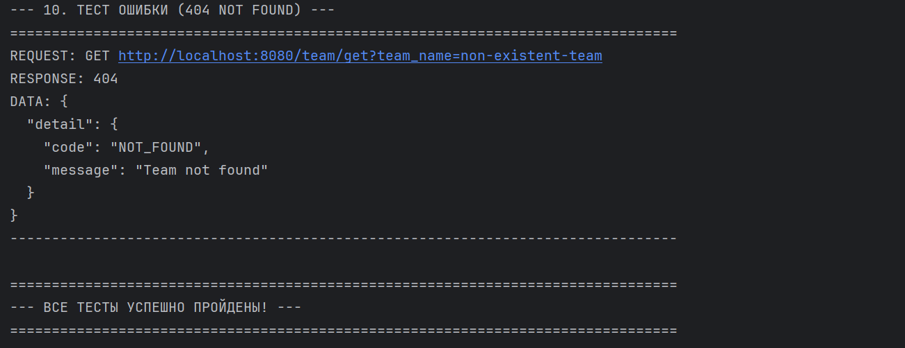

# Сервис назначения ревьюеров (тестовое задание)

Краткое описание
-----------------

Этот проект — бэкенд-микросервис для автоматического назначения ревьюеров на Pull Request'ы.
Сервис предоставляет HTTP API на FastAPI и использует асинхронное подключение к PostgreSQL.

Возможности
-----------

- Управление командами и пользователями
- Автоматическое назначение ревьюеров при создании PR с балансировкой нагрузки
- Переназначение ревьюеров (reassign)
- Безопасная деактивация пользователей с автоматическим переназначением их PR

Технологии
----------

- Язык: Python 3.11
- Веб-фреймворк: FastAPI
- База данных: PostgreSQL 16
- ORM: SQLAlchemy (асинхронный, asyncio)
- Миграции: Alembic
- Оркестрация: Docker / Docker Compose

Быстрый старт
-------------

> Требования: Docker и docker-compose установлены на машине.

1. Клонируйте репозиторий и перейдите в каталог проекта:

```bash
git clone https://github.com/MrAmfix/AvitoTechIntership.git
```

2. Создайте файл `.env` в корне проекта (если его нет). Проверьте, что указаны переменные окружения:

```bash
cp .env.example .env
```

3. Запустите всё одним docker-compose-командой:

```bash
docker-compose up --build
```

Проверка
--------

Сервис будет доступен по адресу http://localhost:8080 (или на порту, указанном в `.env` как `API_PORT`).

Интерактивная документация (Swagger):

- http://localhost:8080/docs

E2E Тестирование (End-to-End)

В дополнение к unit-тестам, в проекте есть скрипт для E2E-тестирования (`tests/e2e.py`), который проверяет полный жизненный цикл API.

Важно: Этот тест запускается вручную с вашей локальной машины и выполняется против уже запущенного сервиса.

Как запустить E2E-тест:

Убедитесь, что у вас установлен Python и библиотека requests:

```bash
pip install requests
```

Сначала поднимите весь сервис, как описано в разделе "Быстрый старт":

```bash
docker-compose up --build
```

Дождитесь, пока API полностью запустится.

В новом окне терминала (не в docker-compose) запустите E2E-тест-скрипт:

```bash
python tests/e2e.py
```

Скрипт автоматически выполнит серию запросов: создаст команду, PR, проверит автоназначение, переназначение, деактивацию пользователя и корректную обработку ошибок. В случае успеха вы увидите сообщение "ВСЕ ТЕСТЫ УСПЕШНО ПРОЙДЕНЫ!".

Скриншот прохождения теста на локальной машине:


Ключевые решения и допущения
---------------------------

Ниже описаны важные архитектурные решения и поведение, выбранное при реализации, которые не были явно перечислены в ТЗ.

1. Продвинутая балансировка нагрузки ревьюеров

- Проблема: простое случайное распределение или «жадный» выбор приводили к неравномерной нагрузке.
- Решение: реализован взвешенный случайный выбор.
  - Для каждого активного кандидата (кроме автора) рассчитывается вес:
    weight = 1 / (1 + open_reviews_count)
  - Пример: новичок (0 открытых PR) — вес 1.0; ветеран (5 открытых PR) — вес 0.166.
  - Два ревьюера выбираются с учётом этих весов (random.choices).
- Результат: плавное выравнивание нагрузки без создания бутылочного горлышка.

2. Логика переназначения (`/pullRequest/reassign`)

- В ТЗ указывалось: "переназначить... на другого из его команды".
- Замечание: это может показаться непривычным, если пользователь сменил команду — но реализация строго следует описанию в openapi.yml: замена ищется в текущей команде заменяемого пользователя.

3. Пограничный случай «возвращающийся ревьюер»

- Сценарий: PR имел ревьюеров [A, B]; вызов reassign(A) → [B, C]; затем reassign(B) → A снова может быть назначен, получаем [C, A].
- Решение: это поведение признано допустимым, т.к. в ТЗ не требовалась история назначений. Исключаются только текущие ревьюеры. К тому же пришлось бы хранить историю назначений, что усложнило бы реализацию.

4. Безопасная деактивация (`/users/setIsActive`)

- Проблема: пользователь с `is_active = false` не должен назначаться, но может уже быть назначен на открытые PR.
- Поведение: при деактивации выполняется следующее в одной атомарной транзакции:
  - Находятся все ОТКРЫТЫЕ PR, где пользователь является ревьюером.
  - Для каждого PR пытается найти активную замену внутри команды пользователя (логика аналогична `reassign`).
  - Если замена найдена — добавляется; если нет — пользователь удаляется из списка ревьюеров PR.
